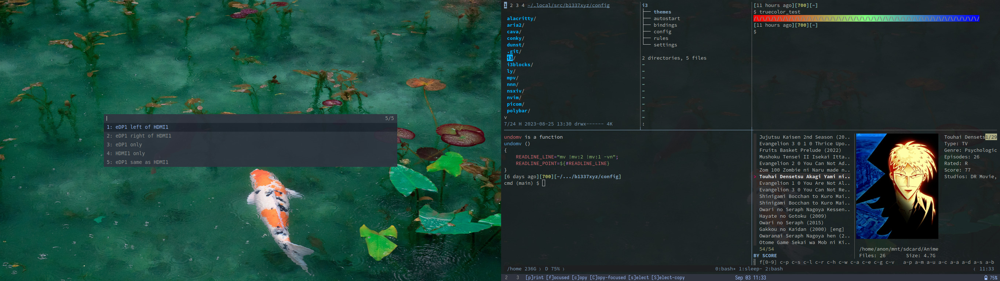

## *~/.config*
```
      /\         OS: Arch Linux x86_64
     /  \        Shell: bash
    /\   \       WM: i3
   /      \      Font: Iosevka Nerd Font
  /   ,,   \     Terminal: alacritty/tmux
 /   |  |  -\    Terminal Font: Comic Mono
/_-''    ''-_\    
```


[Wallpapers](https://gitlab.com/b1337xyz/wallpapers)
