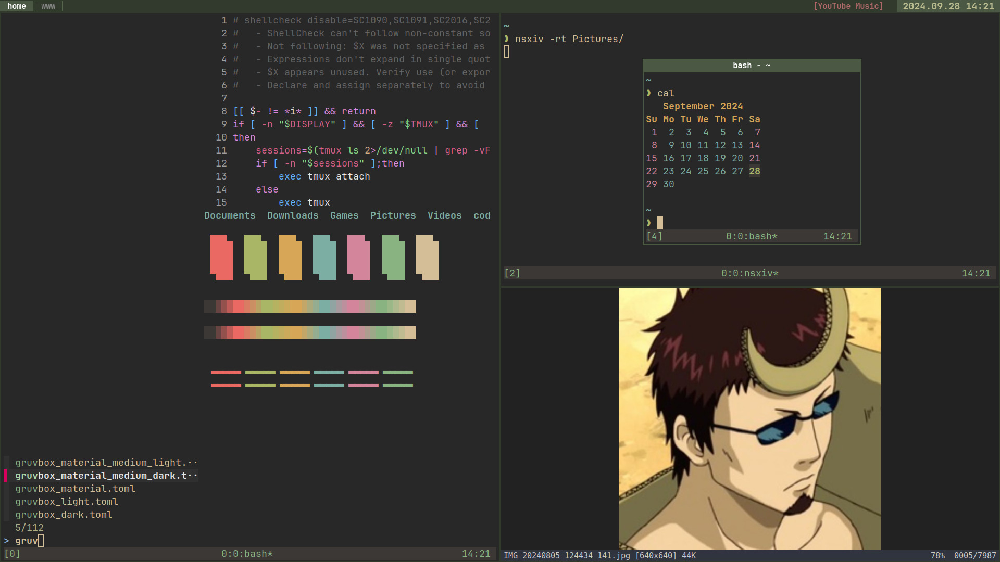
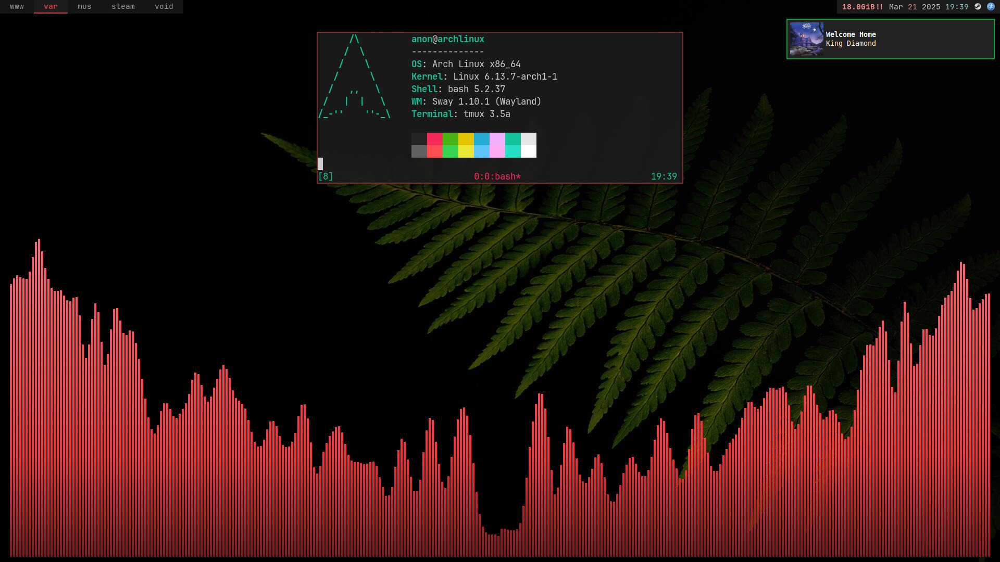

## *~/.config*
```
      /\         OS: Arch Linux x86_64
     /  \        Shell: bash
    /\   \       WM: i3/sway
   /      \      Bar: i3status/waybar
  /   ,,   \     Notifications: dunst/mako
 /   |  |  -\    Terminal: alacritty/foot+tmux
/_-''    ''-_\   Terminal Font: JetBrainsMono Nerd Font 
```
## i3


## Sway

