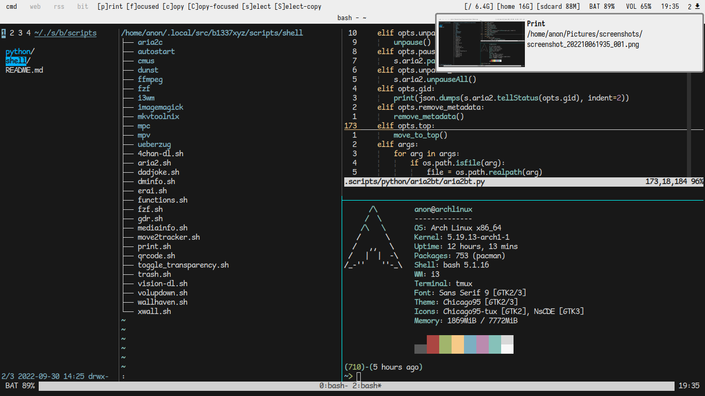

```
      /\         OS: Arch Linux x86_64
     /  \        Shell: bash
    /\   \       WM: i3
   /      \      Terminal: alacritty/tmux
  /   ,,   \     Terminal Font: mononoki Nerd Font Mono
 /   |  |  -\    Font: DejaVu Serif Semi-Condensed 10 [GTK2/3]
/_-''    ''-_\   Theme: NsCDE [GTK2], Chicago95 [GTK3] 
                 Icons: NsCDE [GTK2/3]
```

