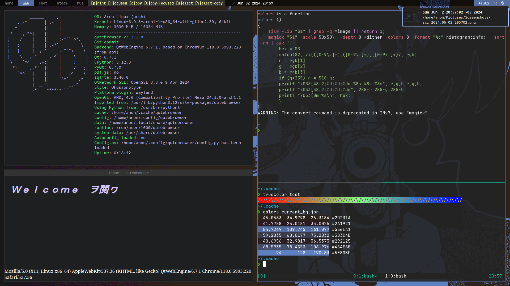

## *~/.config*
```
      /\         OS: Arch Linux x86_64
     /  \        Shell: bash
    /\   \       WM: i3/sway
   /      \      Terminal: alacritty/tmux
  /   ,,   \     Terminal Font: JetBrainsMono Nerd Font
 /   |  |  -\    
/_-''    ''-_\    
```


